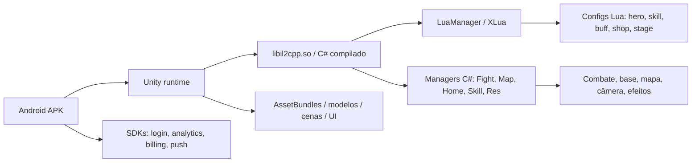
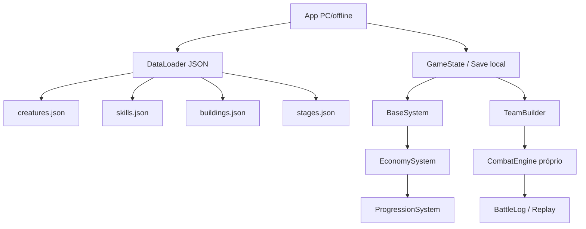

# Palmon Survival - Engenharia do APK, Passo 1

Documento criado em 2026-06-07 a partir da extração local do XAPK `Palmon_ Survival_0.5.277_APKPure.xapk`.

## 1. Objetivo deste documento

Este MD é uma leitura técnica para entender como o jogo foi construído em alto nível: camadas, arquivos, dados, runtime, assets e responsabilidades dos módulos.

O objetivo não é copiar o jogo. Para nosso projeto, a regra é aprender padrões de arquitetura e depois criar mecânicas, nomes, personagens, arte, balanceamento, interface e código próprios.

## 2. Limite prático e legal

Podemos usar a análise para:

- entender arquitetura geral de jogo mobile;
- identificar quais sistemas um jogo desse tipo precisa;
- criar uma versão offline/original com regras e assets próprios;
- documentar quais dados são necessários para combate, base, progressão e economia;
- evitar depender de código, assets, nomes e fórmulas proprietárias.

Não devemos usar:

- código C#/Lua original copiado;
- assets, sprites, modelos, UI, sons ou nomes dos Palmons;
- tabelas de balanceamento idênticas;
- pacote, marca, ícones, textos, telas e identidade visual;
- sistemas de backend, pagamento, login ou SDKs proprietários.

## 3. Fontes locais usadas

| Fonte | Caminho | O que mostra |
|---|---|---|
| XAPK original | `D:\Linkedin\palmon_survival_apk\Palmon_ Survival_0.5.277_APKPure.xapk` | pacote base analisado |
| APK principal extraído | `D:\Linkedin\palmon_survival_apk\main_apk_extracted` | Manifest, DEX, resources Android, SDKs |
| Split de arquitetura | `D:\Linkedin\palmon_survival_apk\config_armeabi_v7a_extracted` | bibliotecas nativas Unity/IL2CPP/XLua |
| Assets extraídos | `D:\Linkedin\palmon_survival_apk\asset_apk_extracted` | bundles, modelos, cenas, texturas, luabyte |
| Dump IL2CPP | `D:\Linkedin\palmon_survival_apk\analysis\il2cppdump\dump.cs` | classes e assinaturas C# reconstruídas |
| Configs Lua decifradas | `D:\Linkedin\palmon_survival_apk\analysis\lua_decrypted_config_root` | tabelas de gameplay |
| JSONs parseados | `D:\Linkedin\palmon_survival_apk\analysis\parsed` | dados usados na Pedia e simulador |

## 4. Árvore geral do APK/XAPK

```text
palmon_survival_apk/
├─ Palmon_ Survival_0.5.277_APKPure.xapk
├─ main_apk_extracted/
│  ├─ AndroidManifest.xml
│  ├─ classes.dex ... classes4.dex
│  ├─ resources.arsc
│  ├─ assets/
│  ├─ res/
│  ├─ kotlin/
│  └─ okhttp3/
├─ config_armeabi_v7a_extracted/
│  └─ lib/armeabi-v7a/
│     ├─ libil2cpp.so
│     ├─ libunity.so
│     ├─ libxlua.so
│     ├─ libCrashSight.so
│     └─ outras libs SDK/nativas
├─ asset_apk_extracted/
│  └─ assets/
│     ├─ asset/
│     ├─ audio/
│     ├─ luabyte/
│     ├─ models/
│     ├─ packages/
│     ├─ renderpipeline/
│     ├─ scenes/
│     ├─ shader/
│     ├─ textures/
│     └─ uiv3/
└─ analysis/
   ├─ il2cppdump/
   ├─ lua_decrypted_config_root/
   ├─ parsed/
   ├─ exported_ui_images/
   └─ demais pastas de extração
```

## 5. Leitura rápida da arquitetura

O jogo é, com alta confiança, um jogo Unity usando IL2CPP, XLua e dados de gameplay em tabelas Lua.

Fluxo provável:



Interpretação:

- Android é a casca de instalação, permissões, login, billing e SDKs.
- Unity renderiza o jogo, cenas, UI, modelos e efeitos.
- IL2CPP contém a lógica C# compilada.
- XLua permite rodar scripts/configs Lua e fazer ponte entre C# e dados.
- Tabelas Lua carregam balanceamento, progressão, Palmons, skills, lojas e fases.
- O jogo provavelmente depende de servidor para conta, compras, eventos e parte do estado online.

## 6. Contagem técnica encontrada

| Item | Quantidade observada | Observação |
|---|---:|---|
| Arquivos totais analisados | ~26.869 | extração completa/local |
| Tipos/classes no `dump.cs` | ~12.347 | inclui Unity, SDKs, wrappers e código do jogo |
| Configs Lua em `lua_decrypted_config_root` | 585 | principal fonte de dados de gameplay |
| JSONs no pacote/análise | 2.448 | configs e objetos exportados |
| PNGs | 1.127 | UI/personagens/assets exportados |
| XMLs Android | 849 | resources/layouts/manifest |
| `.bytes` | 720 | assets binários/Unity |
| DLLs reconstruídas | 88 | DummyDll do IL2CPP |
| Bibliotecas `.so` | 12 | Unity, IL2CPP, XLua, SDKs |

## 7. Principais bibliotecas nativas

| Arquivo | Função provável |
|---|---|
| `libil2cpp.so` | código C# compilado para nativo; núcleo do jogo |
| `libunity.so` | engine Unity no Android |
| `libxlua.so` | integração Lua com C#/Unity |
| `libCrashSight.so` | crash reporting/telemetria |
| `libsodium.so` | criptografia/assinatura |
| `libllhsdk.so` | SDK de publisher/login/pagamento |
| `lib_burst_generated.so` | código otimizado Unity Burst |
| `libmain.so` | bootstrap Unity Android |

## 8. Módulos C# importantes no dump IL2CPP

| Módulo/classe | Papel provável | O que aprender para nosso jogo |
|---|---|---|
| `Game : ManagerBase<Game>` | inicialização global do jogo | ter um bootstrap central |
| `ManagerBase<T>` / `ModuleManager<T>` | padrão base para managers | usar módulos separados por responsabilidade |
| `LuaManager` | cria ambiente XLua, chama funções Lua, eventos e parâmetros | separar dados/regras em arquivos configuráveis |
| `LuaEventManager` | ponte de eventos Lua/C# | criar event bus limpo |
| `ResManager` | carrega assets, Lua, bundles, shaders e atualizações | ter um gerenciador de recursos/cache |
| `NetManager` | comunicação online | para offline, substituir por save local/mock server |
| `SDKManager` | login, IAP, configs remotas, SDK externo | não copiar; usar alternativa própria ou remover offline |
| `TaskManager` | coroutines/tarefas assíncronas com pool | controlar rotinas e carregamentos |
| `MapConfigManager` | dados de mapa, quadtrees, câmera, terreno | usar mapa modular/grid/quadtree se necessário |
| `MapManager` | mapa lógico/renderizado, atores e blocos | separar mapa lógico de mapa visual |
| `BigWorldManager` | mundo aberto/camada externa | decidir se nosso jogo terá mundo amplo ou base compacta |
| `HomeBuildingManager` | construções na base/casa | sistema de base separado do combate |
| `BuildingManager` | prédios/cidade/estado de construção | upgrades e produção precisam de módulo próprio |
| `FightManager` | cria/deleta lutas, alvo/inimigo, posições, efeitos | criar combate independente e testável |
| `SkillConfigManager` | carrega configs de skill | manter skills data-driven |
| `SkillManager` | relações e execução de skills | separar cálculo de skill do visual |
| `CardModelSkillActionMgr` | ações visuais de skill em batalha de cartas/Palmons | o visual da skill não deve conter a fórmula |
| `HeroModelSkillActionMgr` | ações de skill ligadas a modelo de herói | animação separada da mecânica |
| `AudioManager` / `HomeAudioManager` | áudio geral e áudio da base | áudio por contexto |
| `CameraManager` / `PVEBattleCameraController` | câmeras por modo | câmera de batalha diferente da câmera de base |
| `GuideManager` | tutorial/onboarding | tutorial como sistema separado |
| `WeatherManager`, `CloudManager`, `RainManager` | clima/ambiente | opcional para nossa versão |

## 9. Configs Lua: onde mora o gameplay

O padrão dos arquivos Lua é uma tabela `data_table`, um tamanho `_G.<nome>Config_Len` e funções de acesso como `Get<nome>ConfigValue(key)`.

Exemplos confirmados:

| Arquivo | Linhas/entradas conhecidas | Função |
|---|---:|---|
| `hero.lua` | 63 entradas | definição dos Palmons/heróis |
| `card_skill_pal.lua` | 8.789 entradas | skills de Palmons por nível/estrela/evolução |
| `skill.lua` | 1.291 entradas | skills/passivas/trabalho/buffs |
| `card_buff_pal.lua` | 10.203 entradas | buffs, debuffs, duração, chance e alvo |
| `hero_evolve_potency.lua` | 9.674 entradas | evolução/potencial/ganhos por nível |
| `hero_evolve.lua` | tabela de evolução | regras/custos de evolução |
| `hero_star.lua` | estrela/raridade | progressão por estrelas |
| `hero_level.lua` | nível | curva de level/custo |
| `shoot_attr.lua` | 1.363 entradas | atributos de modo shooter/personagem |
| `shop.lua` | 160 entradas | lojas e itens |
| `recharge.lua` | monetização | recargas/pacotes |
| `task_system.lua` | missões | tarefas e recompensas |
| `home_work.lua` | 47 entradas | trabalhos na base |
| `guild_expedition_stage.lua` | conteúdo de guilda | fases de expedição |
| `card_arena_npc.lua` | arena/NPC | adversários de arena |
| `boss_levelup.lua` | bosses | progressão de boss |

## 10. Famílias de configs encontradas

| Família | Quantidade aproximada | Exemplos |
|---|---:|---|
| `activity` | 102 | eventos temporários, recompensas, passes |
| `task` | 49 | missão, objetivo, guia |
| `card` | 35 | batalha de Palmons/cartas, NPCs, stages |
| `hero` | 32 | Palmons, evolução, estrela, level, traits |
| `stage` | 31 | fases/campanha/ruínas |
| `npc` | 30 | inimigos e times fixos |
| `recharge` | 26 | compras/pacotes |
| `season` | 25 | conteúdo sazonal/servidor |
| `home` | 23 | base, decoração, trabalho |
| `shop` | 16 | lojas |
| `guild` | 14 | guilda/expedição |
| `boss` | 13 | bosses |
| `equip` | 13 | equipamentos |
| `buff` | 12 | efeitos de combate |
| `build` | 11 | construções |
| `drop` | 10 | loot/recompensas |
| `monster` | 10 | monstros |
| `arena` | 5 | PvP/arena/NPCs |
| `tech` | 4 | tecnologia/upgrades |

## 11. Combate: o que sabemos da construção

Fato confirmado pelo APK:

- Palmons existem em `hero`.
- Skills de Palmons existem em `card_skill_pal`.
- Buffs/debuffs existem em `card_buff_pal`.
- Progressão/evolução existe em `hero_evolve`, `hero_evolve_potency`, `hero_star`, `hero_level`.
- Classes de combate existem no IL2CPP: `FightManager`, `LFight`, `RFight`, `BuildFightData`, `SkillManager`, `SkillConfigManager`, `CardModelSkillActionMgr`, `HeroModelSkillActionMgr`.
- Existem classes para formação: `FormationData`, `FormationConfig`, `FormationNewData`, `FormationGroupData`, `FormationNewConfig`.

Inferência técnica:

- C# gerencia objetos de luta, render, alvo, posição e eventos.
- Lua/configs fornecem os números: dano, duração, chance, alvo, buffs e custo.
- Visual de skill é separado da matemática: há classes de `ActionData` para bullet, efeito, câmera, áudio, movimento e trigger.
- A simulação real completa pode envolver servidor ou estado online; o APK mostra muito dado, mas não confirma toda fórmula final.

Para nosso jogo:

- criar um `CombatEngine` próprio e determinístico;
- deixar `SkillDefinition` separada de `SkillAnimation`;
- usar JSON/SQLite próprios para criaturas, skills, efeitos e progressão;
- evitar nomes, percentuais, quantidades, ícones e composições idênticas.

## 12. Base/construção/produção

Fato confirmado pelo dump/configs:

- Existem `HomeBuildingManager`, `BuildingManager`, `HomeWorkMaterialHelper`, `HomeTile`, `HomeTerrainDrawHelper`, `HomeNavMeshHelper`.
- Configs como `home_work`, `home_decor`, `explore_build_location`, `s00_city_data`, `home_small_tile` indicam base, decoração, tiles, trabalho e localização de construção.

Interpretação:

- A base mistura grid/tile, objetos construíveis, trabalhadores e produção.
- Palmons provavelmente podem trabalhar em tarefas de produção, porque há skills de trabalho e traits de produção.

Para nosso jogo:

- usar grid próprio simples no início;
- cada construção deve ter `tipo`, `nível`, `tempo`, `produção`, `capacidade`, `trabalhadores`;
- criaturas podem ter bônus de trabalho, mas com nomes e categorias próprias.

## 13. Economia, eventos e monetização

Fato confirmado:

- Existem configs `shop`, `recharge`, `gift`, `drop`, `activity_*`, `battlepass`, `season_*`.
- O APK inclui Google Billing, Firebase, Adjust/Facebook e SDK Lilith/Funfizz.

Interpretação:

- O jogo é fortemente orientado por eventos, pacotes e configs remotas.
- Para uma versão offline, esses sistemas devem virar tabelas locais e recompensas jogáveis.

Para nosso jogo:

- não implementar compras reais no protótipo;
- criar loja offline com moedas internas;
- transformar eventos em desafios rotativos locais;
- não copiar preços, nomes de pacotes, calendários ou recompensas exatas.

## 14. UI e assets

Fato confirmado:

- Há diretórios `uiv3`, `textures`, `models`, `audio`, `scenes`, `shader`, `renderpipeline`.
- Imagens de heróis foram exportadas para `analysis\exported_ui_images`.
- A UI do APK tem muitos PNGs e assets próprios.

Para nosso jogo:

- não reutilizar arte exportada;
- criar sprites/ícones próprios ou placeholders;
- usar layout inspirado em boas práticas, não em cópia de tela;
- mudar cores, tipografia, nomes, fluxos visuais e composição.

## 15. O que faz o quê, em linguagem simples

| Camada | Responsabilidade no jogo original | Como fazemos no nosso |
|---|---|---|
| Android shell | instala, abre, permissões, login, billing | app desktop/web ou Unity PC sem billing |
| Unity runtime | render, input, cenas, animação | usar Unity/Godot/web conforme decisão |
| IL2CPP/C# | managers, entidades, recursos, luta, mapa | código próprio em módulos limpos |
| XLua | ponte para dados/scripts Lua | usar JSON, TypeScript ou C# data-driven |
| Configs Lua | números e tabelas do gameplay | configs próprias com schemas simples |
| AssetBundles | assets carregáveis | assets próprios locais |
| SDKs | login, analytics, compras, push | remover no protótipo offline |
| Backend | conta/eventos/estado online | save local ou servidor local próprio |

## 16. Checklist para não ficar igual

Faça diferente:

- nome do jogo;
- nomes, aparência e silhueta das criaturas;
- elementos e relações elementais;
- número de slots de formação ou regra de posicionamento;
- progressão de estrela/evolução;
- fórmula de dano;
- tipos de recursos;
- layout de base;
- nomes de prédios;
- economia e curva de upgrade;
- interface, botões, cores e ícones;
- eventos e missões.

Pode manter como aprendizado genérico:

- arquitetura data-driven;
- separação entre lógica, dados e visual;
- sistema de formação;
- sistema de criaturas com funções;
- base com produção;
- combate automático;
- progressão por level/upgrade;
- ferramenta de simulação para balanceamento.

## 17. Proposta de arquitetura para nosso jogo original



Módulos sugeridos:

| Módulo nosso | Função |
|---|---|
| `CreatureData` | criaturas originais, stats, função, elemento |
| `SkillData` | skills próprias, alvo, efeito, cooldown |
| `EffectSystem` | buffs/debuffs próprios |
| `CombatEngine` | batalha determinística e testável |
| `FormationSystem` | slots/posição/counter |
| `BaseSystem` | construções e produção |
| `WorkerSystem` | criaturas trabalhando |
| `EconomySystem` | moedas/recursos/custos |
| `ProgressionSystem` | level, estrela, evolução própria |
| `EventSystem` | eventos offline/rotativos |
| `SaveSystem` | progresso local |
| `Simulator` | ferramenta para balancear times |

## 18. Plano de próximos passos

1. Passo 2: mapear todos os arquivos Lua de gameplay por categoria e criar um índice completo.
2. Passo 3: desenhar nosso schema original de dados: criaturas, skills, efeitos, construção e recursos.
3. Passo 4: criar um `CombatEngine` próprio simples, sem copiar fórmula.
4. Passo 5: criar criaturas placeholders originais e testar batalha 7v7 ou outra regra nossa.
5. Passo 6: criar protótipo offline com save local.
6. Passo 7: substituir placeholders por arte própria.

## 19. Lacunas atuais

- Ainda não mapeamos todos os 585 arquivos Lua individualmente.
- Ainda não extraímos uma árvore completa de todos os métodos por classe.
- Ainda não confirmamos se a fórmula final de combate é toda local ou parcialmente servidor.
- Ainda não montamos schema próprio do nosso jogo.
- Ainda não definimos qual engine vamos usar para o protótipo: web, Unity, Godot ou outro.

## 20. Conclusão do passo 1

O jogo é construído como um projeto Unity grande, com C# compilado em IL2CPP, ponte XLua, gameplay controlado por centenas de configs Lua, assets em bundles e SDKs externos para login, analytics, compras e operação online.

Para criar algo nosso, o caminho certo é copiar a arquitetura mental, não a implementação: dados separados da lógica, combate testável, assets próprios, nomes próprios, balanceamento próprio e progressão própria.
